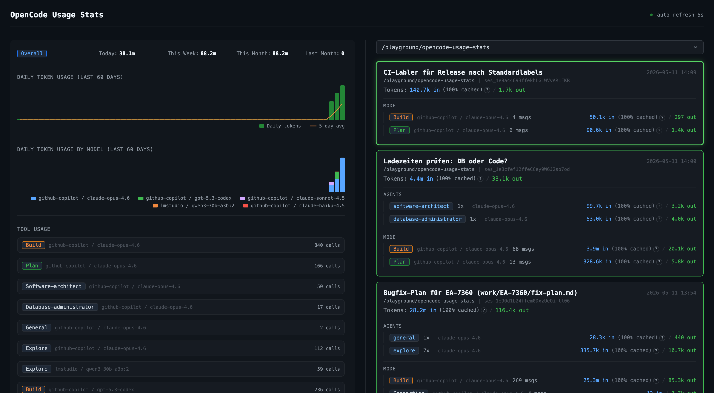

# opencode-usage-stats

Where do all your tokens go? Find out with a real-time dashboard that tracks every token, model, and session across your [OpenCode](https://opencode.ai) projects.



## Features

- **Token tracking** — input, output, reasoning, and cache-read tokens per message
- **Session tracking** — titles, directories, timestamps, parent/child relationships
- **Agent tracking** — subagent types (explore, product-manager, software-architect, etc.) with per-agent token breakdowns
- **Cost tracking** — per-message cost as reported by the provider
- **Local storage** — all data stored in a single SQLite file (`~/.config/opencode/usage-stats.db`), no external services

## Requirements

- [Bun](https://bun.sh) runtime (uses `bun:sqlite` for zero-dependency SQLite)
- [OpenCode](https://opencode.ai) with plugin support

## Installation

Add the plugin to your `opencode.json`:

```json
{
  "plugin": ["@sleipi/opencode-usage-stats"]
}
```

Restart OpenCode to load the plugin. The plugin starts tracking immediately.

### Manual installation (alternative)

```bash
git clone https://github.com/sleipi/opencode-usage-stats-plugin.git
cd opencode-usage-stats-plugin
bun install
ln -s "$(pwd)/src/plugin.ts" ~/.config/opencode/plugins/opencode-usage-stats.ts
```

## Configuration

The plugin reads configuration from `~/.config/opencode/usage-stats.jsonc` (or `.json`). If no config file is found, environment variables are used as fallback.

Example config file:

```jsonc
{
  // Start the dashboard automatically when the plugin loads (default: true)
  "dashboardEnabled": true,
  // Port for the dashboard web server (default: 3333)
  "dashboardPort": 3333
}
```

Environment variable fallbacks (for backward compatibility):

| Variable | Description | Default |
|---|---|---|
| `OPENCODE_USAGE_STATS_DASHBOARD` | Set to `"false"` to disable auto-start | `true` |
| `OPENCODE_USAGE_STATS_PORT` | Dashboard port | `3333` |

## Dashboard

By default the dashboard starts automatically with the plugin. To run it manually instead, disable auto-start in the config and use:

```bash
bunx @sleipi/opencode-usage-stats
```

Or with a custom port:

```bash
OPENCODE_USAGE_STATS_PORT=3334 bunx @sleipi/opencode-usage-stats
```

Opens at [http://localhost:3333](http://localhost:3333).

The dashboard auto-refreshes every 5 seconds and shows:
- Token summary bar (Today / This Week / This Month / Last Month)
- Session cards with token breakdown and agent details
- Cache hit percentages with explanatory tooltips

## Development

See [AGENTS.md](AGENTS.md) for coding standards, test commands, and architecture details.

```bash
bun test tests/unit     # unit tests
bun run test:e2e        # Playwright e2e tests
```

## License

MIT
